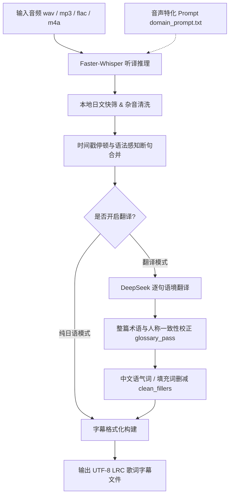

# audio2sub 🎙️

> **专为日语音声作品（ASMR / 广播剧 / 剧情对话）打造的本地 AI 语音听译、智能降噪与双语字幕生成工作台。**

[](https://www.python.org/)
[](https://github.com/SYSTRAN/faster-whisper)
[](https://www.deepseek.com/)
[](https://fastapi.tiangolo.com/)
[](LICENSE)

---

## 🌟 核心特性

- **⚡ 本地离线高精听译**：基于 `faster-whisper` (CTranslate2) 进行本地 GPU/CPU 推理，无大文件上传限制，充分保护隐私，支持 `large-v2`、`small`、`tiny` 等多种模型自由切换。
- **🎯 音声专属领域词表 (`domain_prompt.txt`)**：内置音声作品特化提示词，大幅降低耳语、娇喘、拟声词干扰下的专有名词误识别率。
- **🧹 多阶段智能后处理流水线**：
  - **本地日文杂音快筛**：0 耗时本地过滤 Whisper 偶发的元数据幻觉（如“感谢收看”、“订阅频道”等套话）、韩文/西里尔乱码与复读死循环。
  - **停顿与标点感知断句**：自动聚合碎片段，按自然会话停顿与日语语法重组为流畅整句。
  - **中文语气词精炼**：去除无实义口语填充词（如“んっ、あっ、えっ、うーん”等），压缩多余笑声拟声，打造清爽舒适的阅读体验。
- **🤖 DeepSeek 语境翻译与整篇术语校对**：
  - 口语化成人向音声翻译提示词，拒绝生硬直译；
  - 具备整篇全局一致性校对机制（`glossary_pass`），彻底消灭前文中人物称呼（如“大叔 / 叔叔 / 爷爷”）或人名前后不统一的问题。
- **🎨 三大运行形态**：
  - **Linear 风格桌面客户端 (`desktop.py`)**：基于 PyWebView，具备原生暗黑模式标题栏与精致极简工作台界面。
  - **Web 工作台 (`start_web.bat`)**：基于 FastAPI 后端 + 免构建轻量 SPA，支持任务串行队列、SSE 实时日志流式滚屏与一键下载。
  - **经典轻量客户端 (`app.py`)**：原生 Tkinter GUI，低资源消耗。
- **📑 丰富的输出模式**：支持一键导出精简中文、完整中文、双语对照（中文+日文原文）、双语+精简双份，以及纯日语原文 LRC 歌词文件。

---

## 🔄 核心处理流水线



---

## 📁 目录结构

```text
audio2sub/
├── core/                   # 核心算法与流水线模块
│   ├── transcribe.py       # Whisper 模型加载与音频转写
│   ├── postprocess.py      # 日文去噪、断句合并、语气词清洗
│   ├── translate.py        # DeepSeek 翻译、术语一致性校正
│   └── subtitles.py        # LRC 时间戳与字幕格式装配
├── web/                    # Web 工作台与后端服务
│   ├── server.py           # FastAPI REST API 与静态资源托管
│   ├── jobs.py             # 串行任务队列与 SSE 日志缓冲管理器
│   ├── orchestrator.py     # 流水线执行编排
│   └── static/             # Linear 风格前端 (HTML/CSS/JS)
├── docs/                   # 项目规格与提示词设计文档
├── app.py                  # 经典 Tkinter 原生 GUI 入口
├── desktop.py              # 现代化 PyWebView 桌面端入口
├── config.py               # 全局模型注册、cuBLAS 注入与路径配置
├── domain_prompt.txt       # 音声作品定制领域提示词词表
├── start.bat               # 快速启动 Tkinter 客户端
├── start_app.bat           # 快速启动现代化桌面客户端
├── start_web.bat           # 快速启动 Web 工作台并自动打开浏览器
├── requirements.txt        # 项目依赖清单
├── .api_key.json.example   # API Key 配置示例模板
└── output/                 # 默认字幕输出目录（已加 .gitignore）
```

---

## 🚀 快速上手

### 1. 环境准备

推荐使用 **Python 3.10 ~ 3.12**。建议创建独立的虚拟环境：

```bash
# 克隆仓库
git clone https://github.com/SKYSMOONLINE/audio2sub.git
cd audio2sub

# 创建并激活虚拟环境
python -m venv .venv
# Windows PowerShell:
.venv\Scripts\Activate.ps1
# Windows CMD:
.venv\Scripts\activate.bat
```

### 2. 安装依赖

```bash
pip install -r requirements.txt
```

> **💡 NVIDIA 显卡 (CUDA) 加速说明**：  
> 若需要在 Windows 上使用 GPU 推理，请确保已安装 NVIDIA 驱动及相关 CUDA 运行时支持。如果启动时提示缺少 `cublas64_*.dll`，可在当前环境中安装：
> ```bash
> pip install nvidia-cublas-cu12
> ```
> `config.py` 会自动探测并将相关 DLL 目录注入到系统 `PATH`。

### 3. 配置 API Key

本项目翻译功能使用 DeepSeek API。请复制配置模板并填入您的 API Key：

```bash
cp .api_key.json.example .api_key.json
```

编辑 `.api_key.json`：
```json
{
  "deepseek_key": "sk-your-deepseek-api-key"
}
```
*(注：Web 工作台界面中也支持直接在“设置”面板中输入并保存)*

### 4. 模型准备

`faster-whisper` 支持自动下载模型，您也可以预先下载 CTranslate2 格式的模型至 `models/` 目录下（例如 `models/large-v2`）。

---

## 💻 启动方式

根据个人使用习惯，本项目提供三种启动方式：

### 方式一：现代化桌面客户端（推荐）
双击运行 **`start_app.bat`**，即可启动基于 PyWebView 的独立窗口应用，拥有原生暗黑标题栏与精巧的工作台体验。

### 方式二：网页工作台
双击运行 **`start_web.bat`**，后台将启动 FastAPI 服务并在浏览器中自动打开工作台页面（默认监听 `http://127.0.0.1:8710`）。支持：
- 服务端本地目录浏览（直接在界面选取电脑上的音声目录，免除大文件上传）；
- 实时日志滚动查看；
- 处理进度条与一键批量下载字幕。

### 方式三：经典 Tkinter 原生界面
双击运行 **`start.bat`**，启动轻量级 Tkinter 界面，无需浏览器或 Web 组件。

---

## ⚙️ 高级配置与自定义

- **扩展音声专用词表**：直接编辑根目录下的 `domain_prompt.txt`，添加作品特定的专有名词、角色名字或常用词，每词一行或以逗号分隔，Whisper 会在推理时作为上下文偏好提示。
- **模型与路径配置**：可修改 `config.py` 中的 `MODEL_REGISTRY` 注册本地模型路径，或设置环境变量 `WHISPER_MODEL_LARGE_V2` 等直接指定。

---

## 🔒 隐私与免责声明

1. **隐私安全**：语音转写过程完全在本地计算机上通过 Faster-Whisper 执行，音频文件不会上传至任何第三方服务器。仅在启用翻译时，文本段会通过加密 API 请求发送给 DeepSeek 进行语义翻译。
2. **免责声明**：本项目仅供个人语言学习、听力辅助及技术研究使用，请勿用于侵犯他人版权或违反法律法规的用途。

---

## 📄 开源许可证

本项目基于 [MIT 许可证](LICENSE) 开源。
